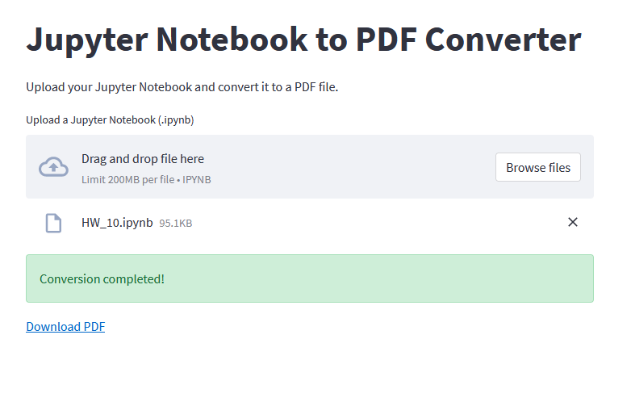

# Jupyter Notebook to PDF Converter

A simple web application built with Streamlit that converts Jupyter Notebooks to PDF files.

## Features

* Upload a Jupyter Notebook file (.ipynb) and convert it to a PDF file
* Download the converted PDF file

## Installation

### Prerequisites

* Python 3.8 or later
* pip
* Docker (optional)

### Clone the repository

Clone this repository to your local machine using:

    git clone https://github.com/yourusername/notebook-to-pdf-converter.git
    cd notebook-to-pdf-converter

### Setup virtual environment (Optional)

It is recommended to create a virtual environment to isolate the dependencies for this project.

    python -m venv venv
    source venv/bin/activate  # For Linux/macOS
    venv\Scripts\activate     # For Windows

### Install dependencies

Install the required dependencies using pip:

    pip install -r requirements.txt

Install wkhtmltopdf

This project requires the wkhtmltopdf tool for PDF conversion. Follow the installation instructions on the official website: https://wkhtmltopdf.org/downloads.html
## Usage
### Running the Streamlit app

To run the Streamlit app, open a terminal, navigate to the project directory, and execute:

    streamlit run notebook_to_pdf_app.py

The app will be accessible at http://localhost:8501 in your browser.

### Using Docker

If you prefer to use Docker, you can build and run the Docker container instead.

Build the Docker image:

    docker build -t notebook-to-pdf-app .

Run the Docker container:

    docker run -p 8501:8501 notebook-to-pdf-app

The app will be accessible at http://localhost:8501 in your browser.

## License

This project is licensed under the MIT License. See the LICENSE file for details.